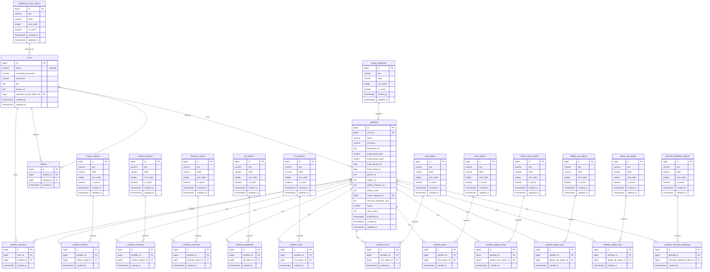

# ER図

```mermaid
erDiagram
  users {
    bigint id PK
    varchar email "UNIQUE"
    varchar encrypted_password
    varchar username
    text bio
    text avatar_url
    bigint experience_level_option_id FK
    timestamptz created_at
    timestamptz updated_at
  }

  portfolios {
    bigint id PK
    bigint user_id FK
    varchar name
    varchar summary
    text thumbnail_url
    smallint build_period_type
    integer build_period_value
    date build_started_on
    date build_ended_on
    text github_url
    text deploy_url
    text deploy_diagram_url
    text deploy_notes
    bigint target_category_id FK
    text interview_feedback_note
    smallint status
    text other_notes
    timestamptz published_at
    timestamptz created_at
    timestamptz updated_at
  }

  follows {
    bigint id PK
    bigint follower_id FK
    bigint followee_id FK
    timestamptz created_at
  }

  portfolio_reactions {
    bigint id PK
    bigint user_id FK
    bigint portfolio_id FK
    timestamptz created_at
  }

  feature_options {
    bigint id PK
    varchar key
    varchar label
    integer sort_order
    boolean is_active
    timestamptz created_at
    timestamptz updated_at
  }

  frontend_options {
    bigint id PK
    varchar key
    varchar label
    integer sort_order
    boolean is_active
    timestamptz created_at
    timestamptz updated_at
  }

  backend_options {
    bigint id PK
    varchar key
    varchar label
    integer sort_order
    boolean is_active
    timestamptz created_at
    timestamptz updated_at
  }

  db_options {
    bigint id PK
    varchar key
    varchar label
    integer sort_order
    boolean is_active
    timestamptz created_at
    timestamptz updated_at
  }

  test_options {
    bigint id PK
    varchar key
    varchar label
    integer sort_order
    boolean is_active
    timestamptz created_at
    timestamptz updated_at
  }

  cicd_options {
    bigint id PK
    varchar key
    varchar label
    integer sort_order
    boolean is_active
    timestamptz created_at
    timestamptz updated_at
  }

  infra_options {
    bigint id PK
    varchar key
    varchar label
    integer sort_order
    boolean is_active
    timestamptz created_at
    timestamptz updated_at
  }

  deploy_front_options {
    bigint id PK
    varchar key
    varchar label
    integer sort_order
    boolean is_active
    timestamptz created_at
    timestamptz updated_at
  }

  deploy_api_options {
    bigint id PK
    varchar key
    varchar label
    integer sort_order
    boolean is_active
    timestamptz created_at
    timestamptz updated_at
  }

  deploy_db_options {
    bigint id PK
    varchar key
    varchar label
    integer sort_order
    boolean is_active
    timestamptz created_at
    timestamptz updated_at
  }

  target_categories {
    bigint id PK
    varchar key
    varchar label
    integer sort_order
    boolean is_active
    timestamptz created_at
    timestamptz updated_at
  }

  interview_feedback_options {
    bigint id PK
    varchar key
    varchar label
    integer sort_order
    boolean is_active
    timestamptz created_at
    timestamptz updated_at
  }

  experience_level_options {
    bigint id PK
    varchar key
    varchar label
    integer sort_order
    boolean is_active
    timestamptz created_at
    timestamptz updated_at
  }

  portfolio_features {
    bigint id PK
    bigint portfolio_id FK
    bigint feature_option_id FK
    timestamptz created_at
  }

  portfolio_frontends {
    bigint id PK
    bigint portfolio_id FK
    bigint frontend_option_id FK
    timestamptz created_at
  }

  portfolio_backends {
    bigint id PK
    bigint portfolio_id FK
    bigint backend_option_id FK
    timestamptz created_at
  }

  portfolio_databases {
    bigint id PK
    bigint portfolio_id FK
    bigint db_option_id FK
    timestamptz created_at
  }

  portfolio_tests {
    bigint id PK
    bigint portfolio_id FK
    bigint test_option_id FK
    timestamptz created_at
  }

  portfolio_cicds {
    bigint id PK
    bigint portfolio_id FK
    bigint cicd_option_id FK
    timestamptz created_at
  }

  portfolio_infras {
    bigint id PK
    bigint portfolio_id FK
    bigint infra_option_id FK
    timestamptz created_at
  }

  portfolio_deploy_fronts {
    bigint id PK
    bigint portfolio_id FK
    bigint deploy_front_option_id FK
    timestamptz created_at
  }

  portfolio_deploy_apis {
    bigint id PK
    bigint portfolio_id FK
    bigint deploy_api_option_id FK
    timestamptz created_at
  }

  portfolio_deploy_dbs {
    bigint id PK
    bigint portfolio_id FK
    bigint deploy_db_option_id FK
    timestamptz created_at
  }

  portfolio_interview_feedbacks {
    bigint id PK
    bigint portfolio_id FK
    bigint interview_feedback_option_id FK
    timestamptz created_at
  }

  experience_level_options ||--o{ users : "selected_by"
  users ||--o{ portfolios : "posts"
  target_categories ||--o{ portfolios : "classifies"

  users ||--o{ follows : "follower"
  users ||--o{ follows : "followee"

  users ||--o{ portfolio_reactions : "reacts"
  portfolios ||--o{ portfolio_reactions : "receives"

  portfolios ||--o{ portfolio_features : "has"
  feature_options ||--o{ portfolio_features : "selected"

  portfolios ||--o{ portfolio_frontends : "has"
  frontend_options ||--o{ portfolio_frontends : "selected"

  portfolios ||--o{ portfolio_backends : "has"
  backend_options ||--o{ portfolio_backends : "selected"

  portfolios ||--o{ portfolio_databases : "has"
  db_options ||--o{ portfolio_databases : "selected"

  portfolios ||--o{ portfolio_tests : "has"
  test_options ||--o{ portfolio_tests : "selected"

  portfolios ||--o{ portfolio_cicds : "has"
  cicd_options ||--o{ portfolio_cicds : "selected"

  portfolios ||--o{ portfolio_infras : "has"
  infra_options ||--o{ portfolio_infras : "selected"

  portfolios ||--o{ portfolio_deploy_fronts : "has"
  deploy_front_options ||--o{ portfolio_deploy_fronts : "selected"

  portfolios ||--o{ portfolio_deploy_apis : "has"
  deploy_api_options ||--o{ portfolio_deploy_apis : "selected"

  portfolios ||--o{ portfolio_deploy_dbs : "has"
  deploy_db_options ||--o{ portfolio_deploy_dbs : "selected"

  portfolios ||--o{ portfolio_interview_feedbacks : "has"
  interview_feedback_options ||--o{ portfolio_interview_feedbacks : "selected"
```
